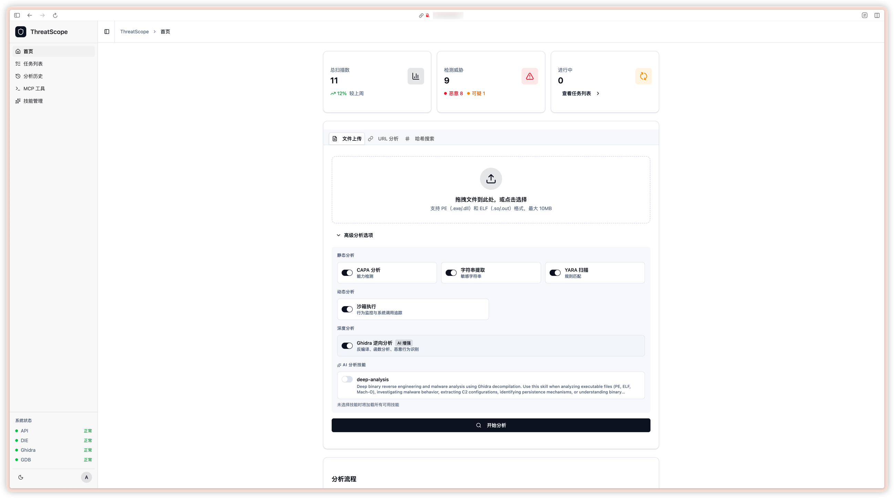
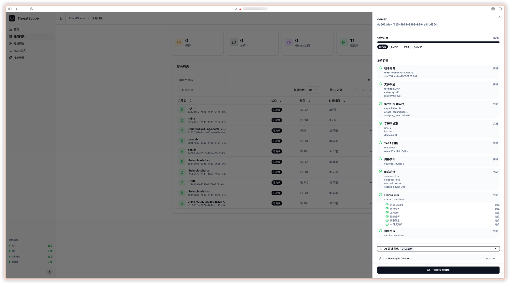
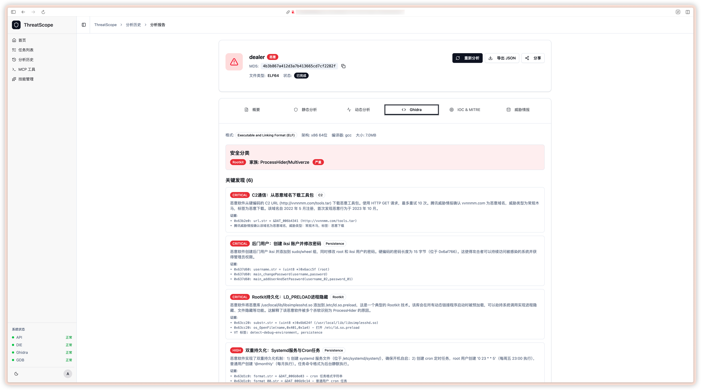

# ThreatScope

AI-driven malware analysis framework — upload a PE/ELF binary, run it through a multi-phase analysis pipeline powered by Claude AI + Ghidra, and view results in a React dashboard.

## Features

- Multi-phase analysis pipeline (file ID → static/dynamic → Ghidra reverse engineering → AI report)
- Claude AI agents for automated binary reverse engineering
- Static analysis: CAPA, YARA, string extraction, threat intelligence
- Dynamic analysis: Tracee syscall tracing, GDB debugging
- MITRE ATT&CK mapping
- MCP server for external AI agent integration
- React dashboard with real-time task tracking



## Quick Start

### Docker (Recommended)

```bash
cp .env.example .env   # Set ANTHROPIC_API_KEY
docker-compose up -d
```

Access at http://localhost

### Local Development

```bash
# Backend
uv sync --extra api --extra ai
uv run uvicorn src.threatscope.api:app --host 0.0.0.0 --port 8000 --reload

# Frontend
cd frontend && npm install && npm run dev
```

- Frontend: http://localhost:5173
- API Docs: http://localhost:8000/docs

## Architecture

```
Upload → Phase 1 (File ID) → Phase 2 (Static + Dynamic) → Phase 3 (Ghidra AI) → Phase 4 (Report)
```

| Service | Role |
|---------|------|
| nginx | Reverse proxy |
| backend | FastAPI + analysis engine |
| frontend | React SPA |
| ghidra | Headless Ghidra + MCP |
| diec | File type detection |
| gdb / gdb-target | Dynamic debugging sandbox |

## Screenshots





## Tech Stack

| Layer | Technology |
|-------|-----------|
| AI | Claude Agent SDK |
| Backend | FastAPI, SQLite |
| Frontend | React 19, TanStack Query, Tailwind, shadcn/ui |
| RE | Ghidra (headless) |
| Deployment | Docker Compose, Nginx |
| Observability | Langfuse |

## Development

```bash
uv run pytest              # Tests
uv run ruff check .        # Lint
uv run ruff format .       # Format
cd frontend && npm run lint
```

## License

MIT
